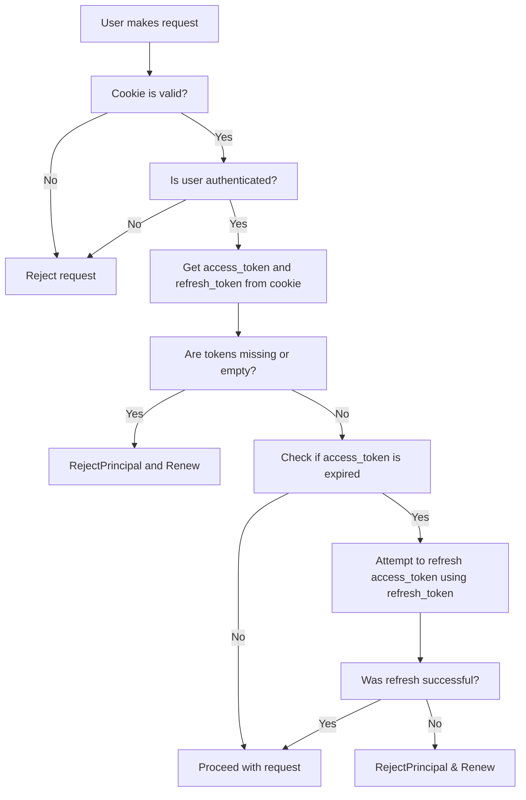

# Token Expiry Handling with Angular BFF Client and Downstream APIs


## Problem

When the `access_token` and `refresh_token` expire, but the **authentication cookie is still valid**, the user will **appear authenticated**, yet calls to downstream APIs will start to fail with `401 Unauthorized`.


## Alternative solutions

To avoid this mismatch there are several possible solutions: 

- **Use CookieEvent to validate the refresh token:** To ensure the session remains valid from the API’s perspective, proactively validate the refresh_token.
- **Implement a global exception handler for downstream API errors:** Set up a global exception handler to capture exceptions from downstream APIs. Specifically, handle 401 responses by throwing a 401 exception, which can then be handled appropriately by the client.
- **Create custom middleware for token management:** Develop middleware that checks the token’s expiration before forwarding requests to downstream APIs. If the token has expired, refresh it automatically before proceeding.
 
### Solution - Use CookieEvent to validate the refresh token

Override the `ValidatePrincipal` method and check the status of both the `access_token` and `refresh_token`. If the `access_token` is expired, attempt to use the `refresh_token` to obtain a new one. If that fails, reject the principal.

> 🔒 This logic must be combined with proper cookie expiration settings using `ExpireTimeSpan` to manage session longevity consistently.



#### Example Implementation

```csharp
public override async Task ValidatePrincipal(CookieValidatePrincipalContext context)
{
    if (context.Principal?.Identity is not null && context.Principal.Identity.IsAuthenticated)
    {
        var tokens = context.Properties.GetTokens();
        var accessToken = tokens.SingleOrDefault(t => t.Name == OpenIdConnectParameterNames.AccessToken);
        var refreshToken = tokens.SingleOrDefault(t => t.Name == OpenIdConnectParameterNames.RefreshToken);

        if (accessToken == null || string.IsNullOrEmpty(accessToken.Value) ||
            refreshToken == null || string.IsNullOrEmpty(refreshToken.Value))
        {
            context.RejectPrincipal();
            context.ShouldRenew = true;
            return;
        }

        var expiresAt = DateTimeOffset.Parse(
            tokens.SingleOrDefault(t => t.Name == "expires_at")?.Value ?? string.Empty,
            CultureInfo.InvariantCulture);

        if (expiresAt <= DateTimeOffset.UtcNow)
        {
            var refreshedTokens = await _userTokenEndpointService.RefreshAccessTokenAsync(
                new UserToken
                {
                    RefreshToken = refreshToken.Value
                },
                new UserTokenRequestParameters());

            if (refreshedTokens.IsError)
            {
                context.RejectPrincipal();
                context.ShouldRenew = true;
                return;
            }
        }
    }

    await base.ValidatePrincipal(context);
}
```

### Solution - Implement a global exception handler for downstream API errors

```
public class TokenExpirationMiddleware
{
    private readonly RequestDelegate _next;

    public TokenExpirationMiddleware(RequestDelegate next) => _next = next;

    public async Task InvokeAsync(HttpContext context)
    {
        var user = context.User;
        if (user.Identity is not null && user.Identity.IsAuthenticated)
        {
            var userToken = await context.GetUserAccessTokenAsync();
            if (userToken.IsError)
            {
                //Handle token expiration in your application in your preffered way
                //await context.SignOutAsync(CookieAuthenticationDefaults.AuthenticationScheme);
            }
        }

        await _next(context);
    }
}


```csharp
