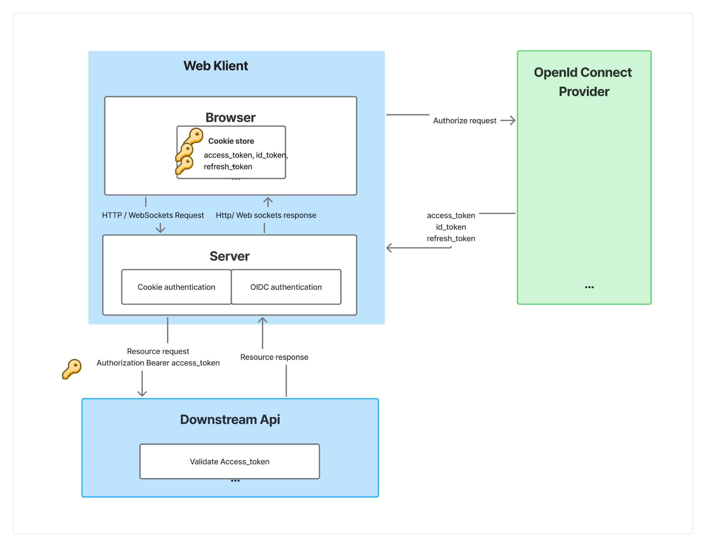

# Token Expiry Handling with Downstream APIs
For applications that handle authentication on the server using cookies and OpenID Connect (OIDC), and that need to call downstream APIs requiring an access_token or DPoP token, it's important to understand that authentication **cookies and tokens have separate lifetimes**.

This means that even if the authentication cookie is still valid, the `access_token` and `refresh_token` may expire. In such cases, the user will appear authenticated in the UI, but API calls to downstream services will begin to fail with `401 Unauthorized` errors.

If you don’t proactively validate or refresh these tokens, you risk users having an active session in the UI but losing access to key functionality that depends on secured API calls.

Guideline for two types of application architectures where authentication is handled on the server: 

- [Angular with a BFF](./AuthenticationWithAngularBFF.md)
- [Blazor with Interactive Server](./AuthenticationWithBlazorServer.md)

