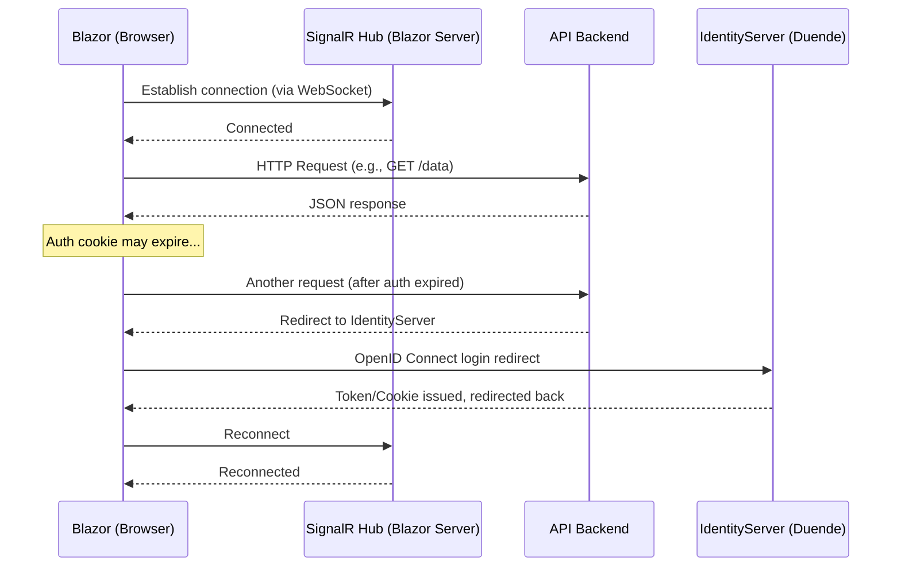

# Token Expiry Handling with Blazor server client and Downstream APIs

## Problem
In Blazor Server, communication between the browser (client) and the server is managed through SignalR, which maintains a persistent connection using WebSockets (or fallback mechanisms). Blazor Server uses SignalR for all UI interactions and event handling. The SignalR connection does not have access to HttpContext or cookies directly. When a client establishes a connection to the SignalR server it creates `HubCallerContext` with ConnectionId, User (Claimsprincipal) and Items (properties). 
 
Unlike traditional HTTP requests where cookies are sent with each request, SignalR only sends cookies once, during the initial connection (handshake). After that, no HTTP headers are included in individual method calls over SignalR.

As a result:

- You cannot access HttpContext.Request.Cookies from inside Blazor components.
- You lose access to cookies during the lifetime of the SignalR connection.
- HubCallerContext.User is not updated when the authentication cookie is renewed.

[Blazor state management](https://learn.microsoft.com/en-us/aspnet/core/blazor/state-management?view=aspnetcore-9.0&pivots=server)
[Blazor Server side authentication](https://learn.microsoft.com/en-us/aspnet/core/blazor/security/?view=aspnetcore-9.0&tabs=visual-studio#server-side-blazor-authentication)

|Scenario | Available in Blazor Server? | Recommendation|
|-----|------------------|------------------|---------|
|HttpContext.Request.Cookies | No | Can be used in a API Controller|
|AuthenticationStateProvider / User | Yes | Reads the claimssprincipal from HubCallerContext|
|ProtectedSessionStorage |  Only after OnAfterRender | Unngå for auth-flow
|HttpContext.GetTokenAsync(...) |No | Use in middleware or controllers|
|Controller + HttpClient | Yes | Best solution to get tokens|

## Alternative solution

### Listen on 401 from downstream API and redirect to login site with full reload

